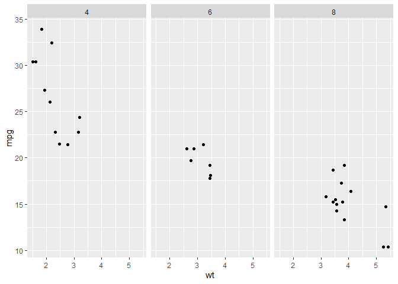

<!-- README.md is generated from README.Rmd. Please edit that file -->

# gridutils

<!-- badges: start -->

<!-- badges: end -->

This package is just my personal practice to play with grid.

## Installation

``` r
# install.packages("devtools")
devtools::install_github("yutannihilation/gridutils")
```

## Usages

### `gu_you_are_here()`

Highlight the current viewport. Unlike `grid::showViewport()`, the
highlight is removed after a while.

``` r
gu_you_are_here()
```

### `gu_print_vp()`

``` r
library(gridutils)

library(ggplot2)
library(grid)

p <- ggplot(mtcars, aes(wt, mpg))
p + geom_point() + facet_wrap(~ cyl)
```



``` r
gu_print_vp()
#> ROOT
#> ├GRID.VP.1
#> │└GRID.VP.2
#> ├strip
#> ├GRID.VP.10
#> │└GRID.VP.11
#> ├GRID.VP.37
#> │└GRID.VP.38
#> ├layout
#> │├axis-b-3-1.9-13-9-13
#> ││├GRID.VP.1
#> │││└GRID.VP.2
#> ││└GRID.VP.3
#> ││ ├GRID.VP.1
#> ││ │└GRID.VP.2
#> ││ └axis
#> ││  ├axis.1-1-1-1
#> ││  └axis.2-1-2-1
#> ││   └GRID.VP.1
#> ││    └GRID.VP.2
#> │├xlab-b.10-13-10-5
#> ││└GRID.VP.37
#> ││ └GRID.VP.38
#> │├axis-l-1-1.8-4-8-4
#> ││├GRID.VP.10
#> │││└GRID.VP.11
#> ││└GRID.VP.12
#> ││ ├GRID.VP.10
#> ││ │└GRID.VP.11
#> ││ └axis
#> ││  ├axis.1-1-1-1
#> ││  │└GRID.VP.10
#> ││  │ └GRID.VP.11
#> ││  └axis.1-2-1-2
#> │├axis-r-1-2.8-10-8-10
#> │├ylab-r.8-15-8-15
#> │├axis-l-1-3.8-12-8-12
#> │├background.1-17-13-1
#> │├axis-t-1-1.6-5-6-5
#> │├title.3-13-3-5
#> │├axis-b-2-1.9-9-9-9
#> ││├GRID.VP.1
#> │││└GRID.VP.2
#> ││└GRID.VP.3
#> ││ ├GRID.VP.1
#> ││ │└GRID.VP.2
#> ││ └axis
#> ││  ├axis.1-1-1-1
#> ││  └axis.2-1-2-1
#> ││   └GRID.VP.1
#> ││    └GRID.VP.2
#> │├xlab-t.5-13-5-5
#> │├caption.11-13-11-5
#> │├panel-2-1.8-9-8-9
#> │├axis-t-3-1.6-13-6-13
#> │├strip-t-3-1.7-13-7-13
#> ││└strip-t-3-1.7-13-7-13
#> ││ └strip.1-1-1-1
#> ││  └GRID.VP.23
#> ││   └GRID.VP.24
#> │├strip-t-1-1.7-5-7-5
#> ││└strip-t-1-1.7-5-7-5
#> ││ └strip.1-1-1-1
#> ││  └GRID.VP.19
#> ││   └GRID.VP.20
#> │├axis-l-1-2.8-8-8-8
#> │├tag.2-2-2-2
#> │├axis-r-1-1.8-6-8-6
#> │├panel-1-1.8-5-8-5
#> │├axis-r-1-3.8-14-8-14
#> │├axis-b-1-1.9-5-9-5
#> ││├GRID.VP.1
#> │││└GRID.VP.2
#> ││└GRID.VP.3
#> ││ ├GRID.VP.1
#> ││ │└GRID.VP.2
#> ││ └axis
#> ││  ├axis.1-1-1-1
#> ││  └axis.2-1-2-1
#> ││   └GRID.VP.1
#> ││    └GRID.VP.2
#> │├axis-t-2-1.6-9-6-9
#> │├subtitle.4-13-4-5
#> │├panel-3-1.8-13-8-13
#> │├ylab-l.8-3-8-3
#> ││└GRID.VP.39
#> ││ └GRID.VP.40
#> │└strip-t-2-1.7-9-7-9
#> │ └strip-t-2-1.7-9-7-9
#> │  └strip.1-1-1-1
#> │   └GRID.VP.21
#> │    └GRID.VP.22
#> └GRID.VP.39
#>  └GRID.VP.40
```

## Resources about grid

  - [R Graphics, Third
    Edition](https://www.crcpress.com/R-Graphics-Third-Edition/Murrell/p/book/9781498789059)
    by Paul Murrel
  - [Getting to Know grid
    Graphics](https://www.stat.auckland.ac.nz/~paul/useR2015-grid/grid-slides.html)
    by Paul Murrel
  - [Mastering Software Development in
    R](https://bookdown.org/rdpeng/RProgDA/the-grid-package.html) by
    Roger D. Peng, Sean Kross, and Brooke Anderson

## The internals

### Grob
